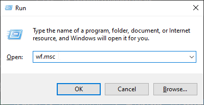
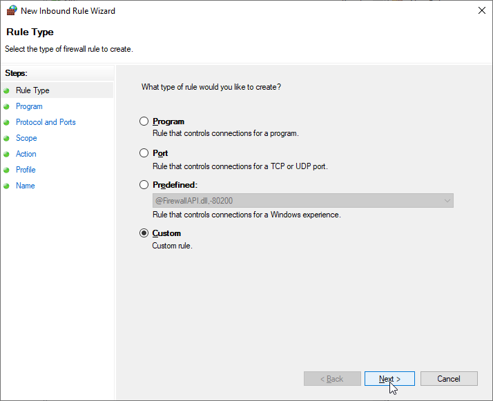
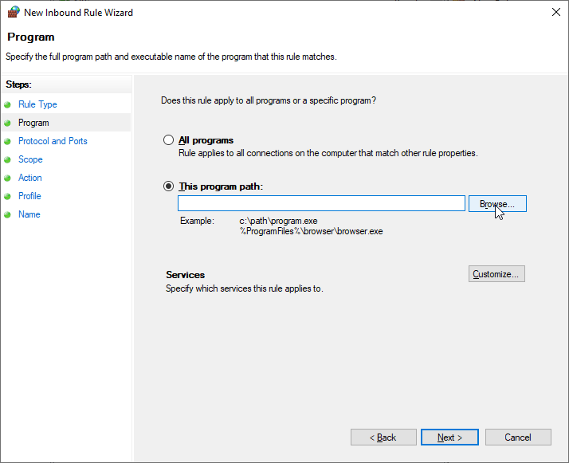
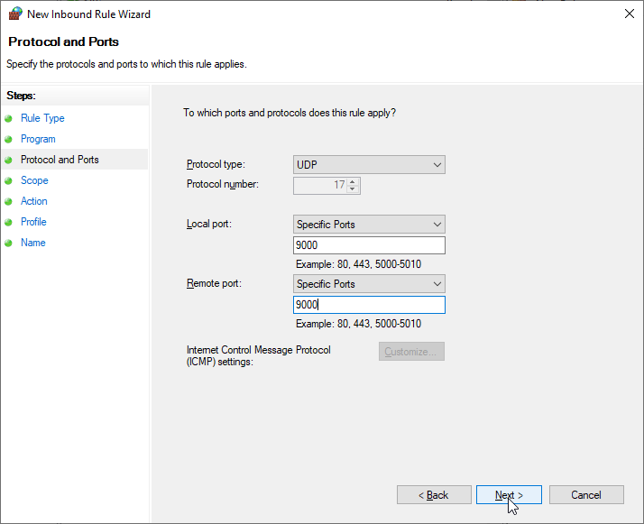
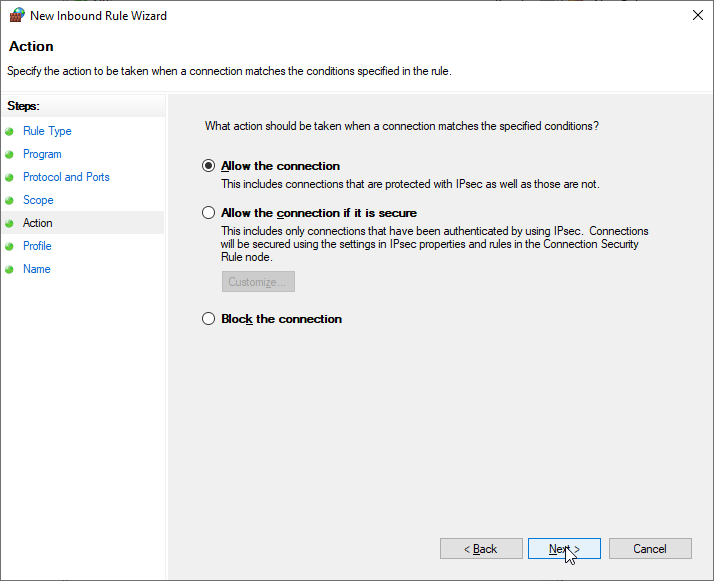
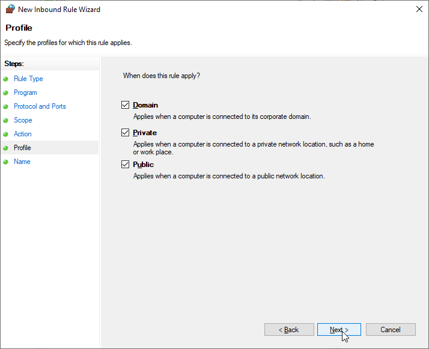
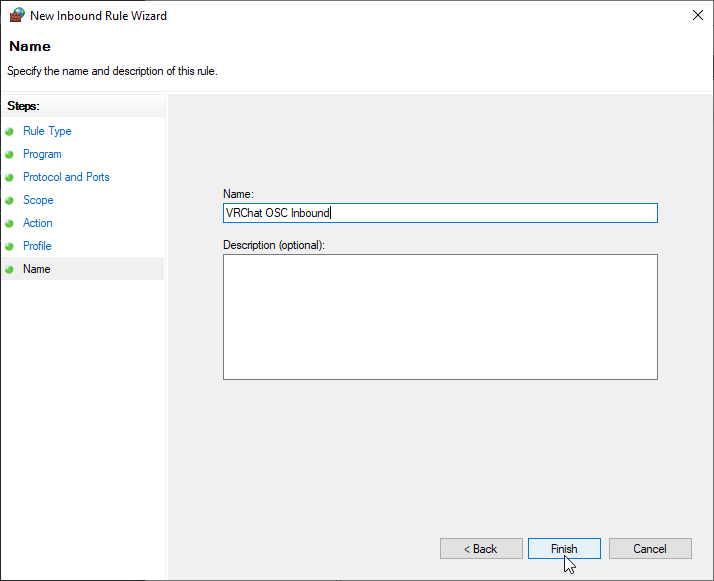
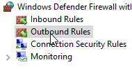
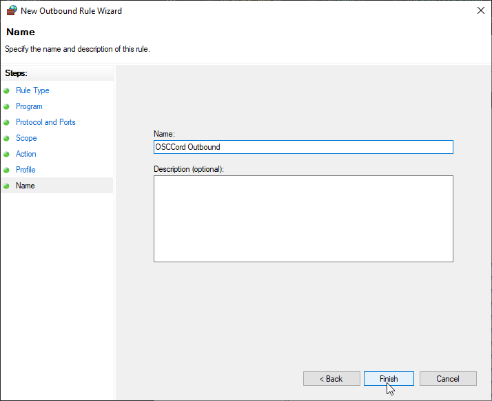

# Guides and Troubleshooting
## Allowing VRChat/OSCCord through your firewall
Your computer's firewall may be blocking OSCCord's Connection and/or VRChat's ability to recieve connections.

The OSC Protocol is communicated over UDP on port 9000. This will detail how to allow VRChat and OSCCord to communicate on that port through Windows Firewall.

**THIS GUIDE DOES NOT DETAIL ON PROPRIETARY FIREWALL SOFTWARE, ONLY THE ONE INCLUDED WITH WINDOWS. YOU'RE ON YOUR OWN WITH THAT.**

Press `Windows Key + R` on your keyboard to open your system run dialog. Type `wf.msc` and press enter or click `OK`.

A window will open containing your firewall overview. On the left side, click `Inbound Rules`.

On the right side, click `New Rule...`

A new window will open called the `New Inbound Rule Wizard`. Click the `Custom` option out of the provided list, then click `Next`.

Select `This program path:` out of the list and click `Browse...`. Find your VRChat Executable and select it. Then, click `Next`.

If you're having trouble locating your install, these are the most common locations for the most common platforms:
- Steam: `C:\Program Files (x86)\Steam\steamapps\common\VRChat\VRChat.exe`
- Oculus Rift/Quest Link: `C:\Program Files\Oculus\Software\Software\vrchat-vrchat\VRChat.exe`

On this next prompt, set each option to the same ones shown in the screenshot below, then click `Next`.

Click `Next` again, this prompt is already set properly.

If not selected already, click `Allow the connection` from the list of given options, then click `Next`.

Depending on what your local network setting is set to, either tick `Private` or `Public`.

*(If you don't know, just tick both. If they're both already ticked, just leave it.)*

Click `Next`.

Name this profile `VRChat OSC Inbound`, and click `Finish`.

You may also need to allow OSCCord through your firewall.

On the left of the window again, click `Outbound Rules`

and follow these instructions exactly as last time, except for two things:

- Set the target program to OSCCord instead of VRChat.

- Name the rule `OSCCord Outbound`.

You can now close your firewall config window.
